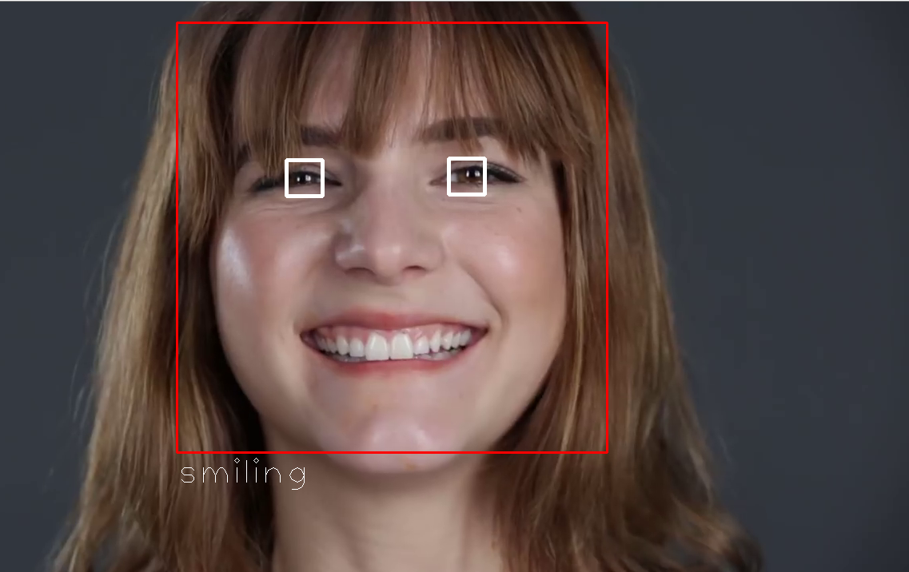
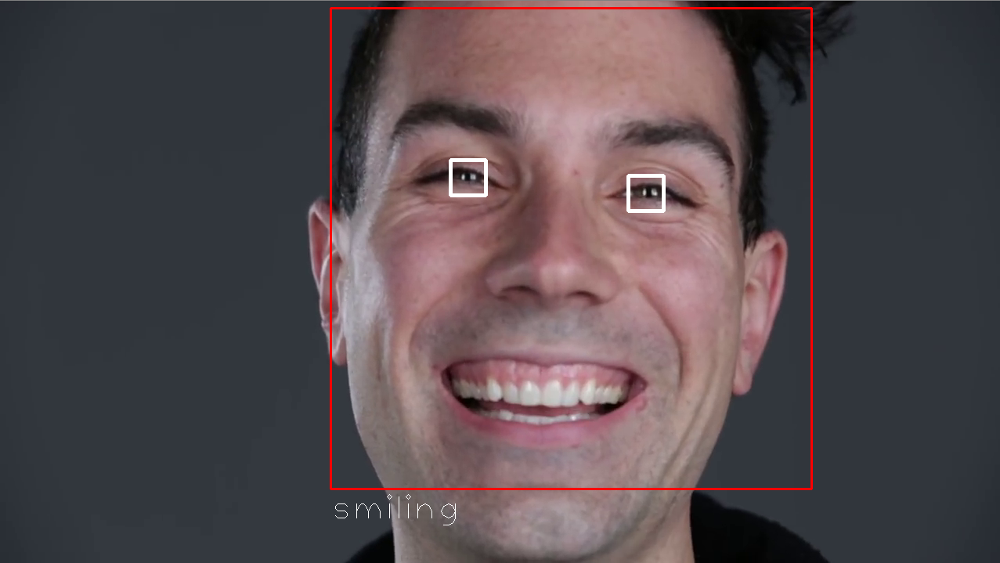
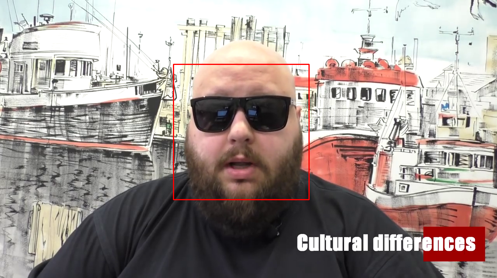

## Python Face, Eye and Smile Detector using Webcam

This is a face, eye and smile detector using a pre-trained face, eye and smile detector
i.e. `face.xml` `eye.xml` `smile.xml`.
You can use your own webcam by having
```
# haarcascade algorithm
video = cv2.VideoCapture(0)
```
or your own video by placing the video in the same directory as `detector.py`.
```
# haarcascade algorithm
video = cv2.VideoCapture('my_video.mp4')
```
A face will have a red border, eyes will have a white border and smiling will print
out 'smiling' at the bottom of the face border, hence, if no face is detected then smiling
cannot happen.

smiling


smiling


not smiling


